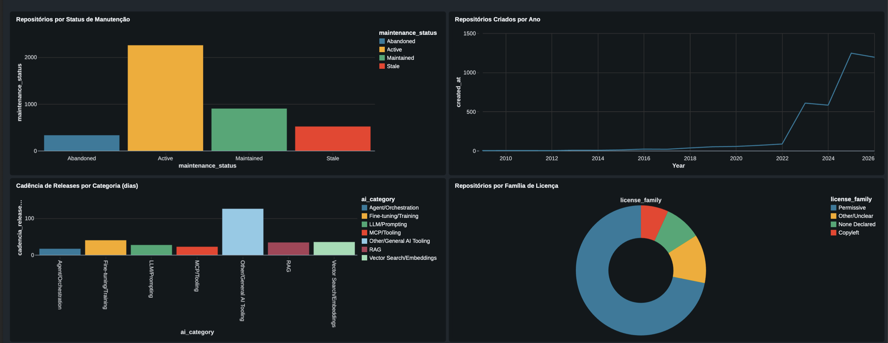
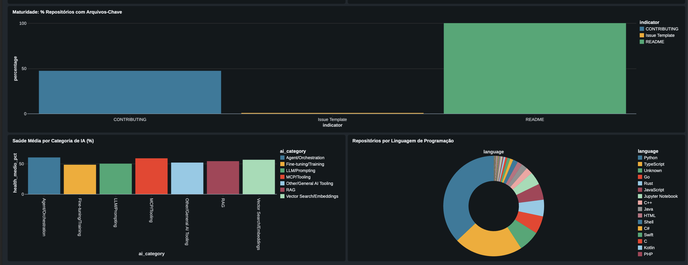

# Lakehouse Project — Arquitetura Medallion (Bronze → Silver → Gold)

## 📌 Visão geral
Projeto de portfólio implementando uma arquitetura **Lakehouse** completa, aplicando o padrão **Medallion** (Bronze, Silver, Gold) para ingestão, transformação e disponibilização de dados analíticos.

O objetivo é demonstrar, na prática, conceitos de engenharia de dados moderna: governança, qualidade de dados, versionamento com Delta Lake e consumo analítico via BI.

## 🏗️ Arquitetura

```
[Fonte de Dados] → [Bronze: Raw] → [Silver: Limpo/Validado] → [Gold: Agregado/Negócio] → [Power BI]
```

- **Bronze**: dados brutos, sem transformação, apenas landing (schema-on-read)
- **Silver**: limpeza, deduplicação, tipagem, enforcement de schema
- **Gold**: agregações e métricas de negócio prontas para consumo

*(diagrama detalhado em `docs/architecture.png`)*

## 🛠️ Stack
| Camada | Tecnologia |
|---|---|
| Processamento | PySpark / Databricks Community Edition |
| Armazenamento | Delta Lake |
| Orquestração | Apache Airflow |
| Governança | Unity Catalog / Hive Metastore |
| Visualização | Power BI |
| Qualidade de dados | Great Expectations |
| CI/CD | GitHub Actions |

## 📂 Estrutura do repositório

```
lakehouse-project/
├── data/raw/            # Dados de origem (Bronze)
├── notebooks/           # Notebooks de ingestão e transformação
├── dags/                 # DAGs de orquestração (Airflow)
├── docs/                 # Diagramas e documentação de arquitetura
├── tests/                 # Testes de qualidade de dados
└── requirements.txt
```

## 🚀 Como executar
1. Clone o repositório
2. Crie o ambiente: `pip install -r requirements.txt`
3. Execute os notebooks na ordem: `01_bronze_ingestion` → `02_silver_transformation` → `03_gold_aggregation`

## 📊 Dataset
**AI Engineering Ecosystem Intelligence** — ~30 mil repositórios do GitHub sobre engenharia de IA (frameworks de agentes, RAG, orquestração, etc.), com métricas de popularidade (estrelas, forks), saúde do repositório (README, licença, cadência de releases) e categorização por tipo de solução de IA.

**Pergunta de negócio**: quais frameworks e categorias do ecossistema de IA estão mais populares, mais bem mantidos e mais ativos — para orientar decisões de adoção de tecnologia.

**Tabelas Gold geradas**:
- `por_categoria`: popularidade e saúde média por categoria de IA (Agent/Orchestration, RAG, etc.)
- `por_linguagem`: distribuição e saúde por linguagem de programação
- `top_repos`: top 20 repositórios ativos mais populares

## 📈 Dashboard

Painel construído no Power BI a partir das tabelas Gold, para responder à pergunta de negócio do projeto: **quais frameworks e categorias do ecossistema de IA estão mais populares, mais bem mantidos e mais ativos.**

### Popularidade e manutenção do ecossistema


- A maioria dos repositórios está **Active** ou **Maintained** — sinal de um ecossistema de ferramentas de IA saudável, não abandonado
- O número de repositórios criados **dispara a partir de 2023**, refletindo o boom de frameworks de IA generativa/agentes
- A categoria **Other/General AI Tooling** tem a maior cadência de releases (dias entre versões), indicando ritmo de evolução acelerado
- **Licenças permissivas** dominam amplamente, favorecendo adoção comercial

### Saúde e maturidade dos repositórios


- Quase todos os repositórios têm **README**, mas poucos têm **CONTRIBUTING** ou template de issue — maturidade de documentação ainda é baixa fora do básico
- A **saúde média** (métrica composta de manutenção) é parecida entre categorias, girando em torno de 50%
- **Python** lidera disparadamente como linguagem do ecossistema de IA, seguido por TypeScript e Go

## 🎯 Decisões de arquitetura
- **Bronze mantém o CSV como veio**, sem parsing de tipos — preserva a fonte original para auditoria/reprocessamento
- **Silver tipa e trata nulos** de forma explícita (datas, booleanos, numéricos) e normaliza colunas multivaloradas (`topics`, `framework_stack`) em arrays — decisão importante porque o dataset bruto trata tudo como string
- **Gold é modelada em 3 tabelas de propósito específico** (por categoria, por linguagem, top repos) em vez de uma tabela única, facilitando o consumo direto por diferentes visões no Power BI

## 👩‍💻 Autora
Luísa — Estudante de Administração (Negócios Internacionais) e Engenharia de Dados, em transição de carreira para Arquitetura de Soluções.
